# C2S VLSI Lab Management Portal — Implementation Plan

A full-stack web application to manage daily operations of the C2S VLSI lab — including student work tracking, project management, task assignment, PC/asset allocation, and attendance.

---

## Tech Stack

| Layer | Technology | Rationale |
|---|---|---|
| **Frontend** | HTML + Vanilla CSS + JavaScript (SPA) | Lightweight, no build tools needed, fast to iterate |
| **Backend** | Node.js + Express.js | Lightweight, great ecosystem, easy REST API development |
| **Database** | SQLite (via `better-sqlite3`) | Zero-config, file-based, perfect for lab-scale usage (~50-100 users) |
| **Auth** | JWT (JSON Web Tokens) + bcrypt | Stateless, secure, easy role-based access control |
| **Integrations** | GitHub REST API, LinkedIn profile links | Pull repo data, link professional profiles |

> [!TIP]
> SQLite is ideal here — no separate database server needed. The entire app can run on a single machine or lab server. If you later need to scale, migrating to PostgreSQL is straightforward.

---

## User Review Required

> [!IMPORTANT]
> **Deployment Environment**: This plan assumes the app will run on a local lab server or a single VPS. If you need cloud hosting (e.g., AWS, Vercel), the architecture may need adjustments.

---

## Confirmed Design Decisions

| Decision | Answer |
|---|---|
| **Total students** | ~9 students |
| **Admins** | Multiple admins/coordinators allowed |
| **Attendance method** | Manual check-in/check-out by students |
| **PCs per student** | 3–4 PCs assigned per student |
| **Hours tracking** | Removed from daily work logs |
| **Notifications** | In-app notification system (no email/WhatsApp) |
| **PC Issues** | Ticket-based system for reporting broken PCs/tools |
| **Account creation** | Admin creates student accounts |

---

## Feature Breakdown

### 🔐 1. Authentication & Role Management

- **Admin accounts** (one or more coordinators) — full control
- **Student accounts** (~9 students, created by admin)
- JWT-based login with role-based route protection
- Password reset functionality
- Session timeout after inactivity

---

### 📝 2. Student Daily Work Log

Students can log their daily activities with:

| Field | Type | Description |
|---|---|---|
| Date | Auto-filled | Today's date (editable for backdating with admin permission) |
| Work Description | Rich text | What was accomplished today |
| Category | Dropdown | Design / Simulation / Layout / Testing / Documentation / Other |
| Tools Used | Multi-select | Cadence Virtuoso, Xilinx Vivado, Synopsys, MATLAB, etc. |
| Attachments | File upload | Screenshots, schematics, simulation results |
| Status | Dropdown | In Progress / Completed / Blocked |

**Features:**
- Calendar view of past logs
- Weekly/monthly summary reports
- Export to PDF/CSV
- Admin can view and comment on any student's log

---

### 🚀 3. Project Tracking

#### Current Projects
- Project name, description, start date
- Team members (if collaborative)
- Status: Active / On Hold / Completed
- Progress percentage (manual or milestone-based)
- Related daily logs linked automatically

#### Past Projects (Portfolio)
- Completed project archive with outcomes
- Total project count displayed on profile
- Tags: ASIC / FPGA / Analog / Digital / Mixed-Signal

#### GitHub Integration
- Student links their GitHub username
- App fetches public repos via GitHub REST API
- Displays: repo name, description, language, stars, last updated
- Direct links to repositories
- Optional: fetch commit activity graphs

#### LinkedIn Integration
- Students add their LinkedIn profile URL
- Displayed as a clickable badge on their profile
- (LinkedIn API is restrictive, so we use direct profile links)

---

### 📋 4. Task/Work Assignment (Admin)

Admin can assign tasks to individual or multiple students:

| Field | Type |
|---|---|
| Task Title | Text |
| Description | Rich text |
| Assigned To | Student(s) selector |
| Priority | Low / Medium / High / Critical |
| Deadline | Date picker |
| Category | Design / Review / Documentation / Lab Work |
| Attachments | Reference files |
| Status | Assigned → In Progress → Under Review → Completed |

**Features:**
- Kanban board view (To Do → In Progress → Done)
- Email/in-app notification on assignment
- Students can update status and add progress notes
- Admin dashboard shows all tasks across all students
- Overdue task highlighting

---

### 🖥️ 5. PC/Asset Management

Admin assigns lab PCs to students (each student is responsible for **3–4 PCs**):

| Field | Type |
|---|---|
| PC ID / Name | e.g., "VLSI-WS-01" |
| Specifications | CPU, RAM, GPU, Storage, OS |
| Installed Software | Cadence, Vivado, etc. |
| Assigned To | Student name (multiple PCs per student) |
| Assignment Date | Date |
| Condition | Excellent / Good / Fair / Needs Repair |
| Notes | Maintenance history, issues |

**Features:**
- Visual lab map showing PC assignments
- **Each student sees their 3–4 assigned PCs** on their dashboard
- Transfer history (when reassigned)
- N PCs trackable with filtering and search

---

### 🎫 5b. PC/Tool Ticket System

Students can raise tickets when a PC or tool is not working:

| Field | Type |
|---|---|
| Ticket ID | Auto-generated (e.g., TKT-001) |
| PC / Tool | Select from assigned PCs or tool list |
| Issue Type | Hardware / Software / Network / Tool License / Other |
| Priority | Low / Medium / High / Critical |
| Description | Detailed issue description |
| Screenshots | Optional file upload |
| Status | Open → In Progress → Resolved → Closed |
| Raised By | Auto-filled (student) |
| Assigned Admin | Admin who picks up the ticket |
| Resolution Notes | How it was fixed |

**Features:**
- Students see their ticket history and status
- Admin sees all open tickets sorted by priority
- In-app notification when ticket status changes
- Ticket analytics (most common issues, avg resolution time)

---

### ✅ 6. Attendance System

| Field | Type |
|---|---|
| Date | Auto-generated |
| Student | Registered student |
| Status | Present / Absent / Late / On Leave |
| Check-in Time | Timestamp |
| Check-out Time | Timestamp |

**Features:**
- Daily attendance dashboard for admin (all 9 students at a glance)
- Students manually check-in when arriving at lab
- Students manually check-out when leaving
- Monthly attendance report with percentage
- Leave request system (student requests → admin approves)
- Calendar heat-map visualization
- Export attendance reports

---

### 📊 7. Additional Features (Value-Adds)

#### 🔔 In-App Notification System
- Real-time notifications within the app (no email/WhatsApp)
- Notification bell icon with unread count badge
- Notification triggers:
  - New task assigned to student
  - Task deadline approaching (24hr warning)
  - Ticket status updated
  - New announcement posted
  - Leave request approved/rejected
- Notification center panel (slide-out drawer)
- Mark as read / Mark all as read
- Stored in database for persistence

#### Admin Dashboard
- Total students (9), active projects, pending tasks at a glance
- Attendance overview (today's present/absent count out of 9)
- Open tickets count
- Recent activity feed
- Weekly performance charts

#### Student Profile & Portfolio
- Personal info, batch, enrollment ID
- Skills/tools proficiency tags
- Assigned PCs (3–4 per student)
- Project portfolio (current + past)
- GitHub repos showcase
- LinkedIn badge
- Attendance percentage
- Performance metrics

#### Announcements & Notice Board
- Admin posts lab announcements
- Pinned notices for important updates
- Archive of past announcements

#### Leaderboard & Gamification
- Points for daily log entries, task completions, attendance
- Monthly top performers
- Streak tracking (consecutive days of work logging)

#### Reports & Analytics
- Student-wise monthly report (auto-generated)
- Project progress reports
- Lab utilization reports (PC usage, attendance trends)
- Export to PDF

---

## Database Schema

```mermaid
erDiagram
    USERS {
        int id PK
        string name
        string email UK
        string password_hash
        string role "admin | student"
        string batch
        string enrollment_id
        string github_username
        string linkedin_url
        string avatar_url
        string skills "JSON array"
        int points "gamification"
        datetime created_at
        datetime updated_at
    }

    DAILY_LOGS {
        int id PK
        int user_id FK
        date log_date
        text work_description
        string category
        string tools_used "JSON array"
        string status
        string attachments "JSON array"
        datetime created_at
        datetime updated_at
    }

    PROJECTS {
        int id PK
        string name
        text description
        string type "ASIC | FPGA | Analog | Digital | Mixed-Signal"
        string status "active | on_hold | completed"
        int progress_percent
        date start_date
        date end_date
        string github_repo_url
        datetime created_at
    }

    PROJECT_MEMBERS {
        int id PK
        int project_id FK
        int user_id FK
        string role "lead | member"
        date joined_at
    }

    TASKS {
        int id PK
        string title
        text description
        int assigned_by FK
        string priority "low | medium | high | critical"
        string status "assigned | in_progress | under_review | completed"
        string category
        date deadline
        string attachments "JSON array"
        datetime created_at
        datetime updated_at
    }

    TASK_ASSIGNMENTS {
        int id PK
        int task_id FK
        int user_id FK
        text progress_notes
        datetime assigned_at
        datetime completed_at
    }

    PCS {
        int id PK
        string pc_name UK
        string specs "JSON - CPU, RAM, etc."
        string installed_software "JSON array"
        string condition
        text notes
        datetime created_at
    }

    PC_ASSIGNMENTS {
        int id PK
        int pc_id FK
        int user_id FK
        date assigned_date
        date unassigned_date
        string status "active | transferred"
    }

    NOTIFICATIONS {
        int id PK
        int user_id FK
        string type "task | ticket | announcement | leave | deadline"
        string title
        text message
        string link "URL to relevant page"
        boolean is_read
        datetime created_at
    }

    TICKETS {
        int id PK
        string ticket_number UK "TKT-001"
        int pc_id FK
        int raised_by FK
        int assigned_admin FK
        string issue_type "hardware | software | network | license | other"
        string priority "low | medium | high | critical"
        text description
        string screenshots "JSON array"
        string status "open | in_progress | resolved | closed"
        text resolution_notes
        datetime created_at
        datetime resolved_at
    }

    ATTENDANCE {
        int id PK
        int user_id FK
        date attendance_date
        string status "present | absent | late | on_leave"
        datetime check_in_time
        datetime check_out_time
    }

    LEAVE_REQUESTS {
        int id PK
        int user_id FK
        date start_date
        date end_date
        string reason
        string status "pending | approved | rejected"
        int approved_by FK
        datetime created_at
    }

    ANNOUNCEMENTS {
        int id PK
        int created_by FK
        string title
        text content
        boolean is_pinned
        datetime created_at
    }

    USERS ||--o{ DAILY_LOGS : "writes"
    USERS ||--o{ TASK_ASSIGNMENTS : "receives"
    USERS ||--o{ PC_ASSIGNMENTS : "responsible for 3-4"
    USERS ||--o{ ATTENDANCE : "has"
    USERS ||--o{ NOTIFICATIONS : "receives"
    USERS ||--o{ LEAVE_REQUESTS : "submits"
    USERS ||--o{ TICKETS : "raises"
    USERS ||--o{ PROJECT_MEMBERS : "participates in"
    PROJECTS ||--o{ PROJECT_MEMBERS : "has"
    TASKS ||--o{ TASK_ASSIGNMENTS : "assigned to"
    PCS ||--o{ PC_ASSIGNMENTS : "assigned via"
    PCS ||--o{ TICKETS : "has issues"
    USERS ||--o{ ANNOUNCEMENTS : "creates"
```



---

## Project Structure

```
c2s-vlsi-portal/
├── package.json
├── server.js                    # Express server entry point
├── .env                         # Environment variables (JWT_SECRET, PORT, etc.)
│
├── database/
│   ├── schema.sql               # SQLite schema creation
│   ├── seed.sql                 # Initial admin account + sample data
│   └── db.js                    # Database connection & helpers
│
├── middleware/
│   ├── auth.js                  # JWT verification middleware
│   ├── roleGuard.js             # Role-based access control
│   └── upload.js                # File upload handling (multer)
│
├── routes/
│   ├── auth.routes.js           # Login, logout, password reset
│   ├── users.routes.js          # User CRUD (admin only)
│   ├── dailyLogs.routes.js      # Daily work log CRUD
│   ├── projects.routes.js       # Project management
│   ├── tasks.routes.js          # Task assignment & tracking
│   ├── pcs.routes.js            # PC/asset management
│   ├── attendance.routes.js     # Attendance & leave
│   ├── announcements.routes.js  # Notice board
│   └── github.routes.js         # GitHub API proxy
│
├── public/                      # Frontend (served as static files)
│   ├── index.html               # SPA entry point
│   ├── css/
│   │   ├── design-system.css    # CSS variables, tokens, base styles
│   │   ├── components.css       # Reusable component styles
│   │   ├── layouts.css          # Page layout styles
│   │   └── animations.css       # Transitions & micro-animations
│   ├── js/
│   │   ├── app.js               # SPA router & main controller
│   │   ├── api.js               # API client (fetch wrapper with JWT)
│   │   ├── auth.js              # Login/logout UI logic
│   │   ├── dashboard.js         # Dashboard page
│   │   ├── dailyLog.js          # Daily work log page
│   │   ├── projects.js          # Projects page
│   │   ├── tasks.js             # Tasks/Kanban page
│   │   ├── pcs.js               # PC management page
│   │   ├── attendance.js        # Attendance page
│   │   ├── profile.js           # Student profile page
│   │   ├── announcements.js     # Announcements page
│   │   └── components/
│   │       ├── navbar.js        # Navigation sidebar
│   │       ├── modal.js         # Reusable modal component
│   │       ├── toast.js         # Toast notifications
│   │       ├── calendar.js      # Calendar widget
│   │       ├── kanban.js        # Kanban board component
│   │       └── charts.js        # Chart wrappers (Chart.js)
│   ├── assets/
│   │   ├── logo.svg
│   │   └── icons/
│   └── uploads/                 # User-uploaded files
│
└── utils/
    ├── github.js                # GitHub API helper functions
    ├── pdf-export.js            # PDF report generation
    └── validators.js            # Input validation helpers
```

---

## API Routes

### Authentication
| Method | Route | Description | Access |
|---|---|---|---|
| POST | `/api/auth/login` | Login with email & password | Public |
| POST | `/api/auth/logout` | Invalidate token | All |
| POST | `/api/auth/reset-password` | Reset password | All |
| GET | `/api/auth/me` | Get current user profile | All |

### Users (Admin)
| Method | Route | Description | Access |
|---|---|---|---|
| GET | `/api/users` | List all students | Admin |
| POST | `/api/users` | Create student account | Admin |
| PUT | `/api/users/:id` | Update student details | Admin |
| DELETE | `/api/users/:id` | Deactivate student | Admin |
| GET | `/api/users/:id/profile` | Get student full profile | All |

### Daily Logs
| Method | Route | Description | Access |
|---|---|---|---|
| GET | `/api/daily-logs` | List own logs (with date filters) | Student |
| GET | `/api/daily-logs/user/:id` | List a student's logs | Admin |
| POST | `/api/daily-logs` | Create today's log entry | Student |
| PUT | `/api/daily-logs/:id` | Update a log entry | Student (own) |
| DELETE | `/api/daily-logs/:id` | Delete a log entry | Student (own) / Admin |

### Projects
| Method | Route | Description | Access |
|---|---|---|---|
| GET | `/api/projects` | List all projects | All |
| POST | `/api/projects` | Create a project | Admin / Student |
| PUT | `/api/projects/:id` | Update project | Members / Admin |
| GET | `/api/projects/:id/members` | Get project members | All |
| POST | `/api/projects/:id/members` | Add member to project | Admin |

### Tasks
| Method | Route | Description | Access |
|---|---|---|---|
| GET | `/api/tasks` | List tasks (filtered by role) | All |
| POST | `/api/tasks` | Create & assign task | Admin |
| PUT | `/api/tasks/:id` | Update task details | Admin |
| PUT | `/api/tasks/:id/status` | Update task status | Assigned student |
| GET | `/api/tasks/kanban` | Get tasks in kanban format | All |

### PCs
| Method | Route | Description | Access |
|---|---|---|---|
| GET | `/api/pcs` | List all PCs | All |
| GET | `/api/pcs/my` | List my assigned PCs (3-4) | Student |
| POST | `/api/pcs` | Add a PC | Admin |
| PUT | `/api/pcs/:id` | Update PC details | Admin |
| POST | `/api/pcs/:id/assign` | Assign PC to student | Admin |

### Tickets
| Method | Route | Description | Access |
|---|---|---|---|
| GET | `/api/tickets` | List all tickets | Admin |
| GET | `/api/tickets/my` | List my raised tickets | Student |
| POST | `/api/tickets` | Raise a new ticket | Student |
| PUT | `/api/tickets/:id` | Update ticket (assign admin, status) | Admin |
| PUT | `/api/tickets/:id/resolve` | Resolve ticket with notes | Admin |

### Notifications
| Method | Route | Description | Access |
|---|---|---|---|
| GET | `/api/notifications` | Get my notifications | All |
| GET | `/api/notifications/unread-count` | Get unread count | All |
| PUT | `/api/notifications/:id/read` | Mark as read | All |
| PUT | `/api/notifications/read-all` | Mark all as read | All |

### Attendance
| Method | Route | Description | Access |
|---|---|---|---|
| POST | `/api/attendance/check-in` | Student check-in | Student |
| POST | `/api/attendance/check-out` | Student check-out | Student |
| GET | `/api/attendance/today` | Today's attendance list | Admin |
| GET | `/api/attendance/report` | Monthly attendance report | Admin |
| POST | `/api/leave-requests` | Submit leave request | Student |
| PUT | `/api/leave-requests/:id` | Approve/reject leave | Admin |

### GitHub
| Method | Route | Description | Access |
|---|---|---|---|
| GET | `/api/github/:username/repos` | Fetch user's public repos | All |

### Announcements
| Method | Route | Description | Access |
|---|---|---|---|
| GET | `/api/announcements` | List announcements | All |
| POST | `/api/announcements` | Create announcement | Admin |
| DELETE | `/api/announcements/:id` | Delete announcement | Admin |

---

## UI Pages & Design

### Design Language
- **Theme**: Dark mode primary with glassmorphism effects
- **Colors**: Deep navy (#0a0e27) background, electric blue (#4f8fff) accents, vibrant gradients
- **Typography**: Inter (Google Fonts) — clean, modern, highly readable
- **Icons**: Lucide Icons (lightweight, consistent)
- **Charts**: Chart.js for analytics visualizations
- **Animations**: Smooth CSS transitions, staggered card entrances, hover lift effects

### Pages

| # | Page | Role | Key Elements |
|---|---|---|---|
| 1 | **Login** | Public | Glassmorphic login card, animated background |
| 2 | **Admin Dashboard** | Admin | Stats cards, attendance donut, recent activity, task overview |
| 3 | **Student Dashboard** | Student | Today's tasks, streak counter, quick log entry, announcements |
| 4 | **Daily Work Log** | Student | Calendar view + log form, timeline of entries |
| 5 | **Projects** | All | Project cards grid, GitHub repo integration, filters |
| 6 | **Task Board** | All | Kanban board (drag-and-drop), task detail modal |
| 7 | **PC Management** | Admin | PC grid/table with assignment status, visual lab map |
| 8 | **Attendance** | All | Calendar heatmap, check-in button, monthly stats |
| 9 | **Student Profile** | All | Portfolio view, GitHub repos, project showcase, stats |
| 10 | **User Management** | Admin | Student table, create/edit forms |
| 11 | **Announcements** | All | Notice board, pinned items, create form (admin) |
| 12 | **Reports** | Admin | Generated reports, charts, export buttons |

---

## Implementation Phases

### Phase 1: Foundation (Core Setup)
- [ ] Project initialization (npm, Express, SQLite)
- [ ] Database schema creation & seed data
- [ ] Authentication system (JWT + bcrypt)
- [ ] Design system CSS (variables, components, dark theme)
- [ ] SPA router & navigation sidebar
- [ ] Login page

### Phase 2: Student Features
- [ ] Student dashboard
- [ ] Daily work log (CRUD + calendar view)
- [ ] Project tracking (create, update, view)
- [ ] Student profile page
- [ ] GitHub integration (fetch & display repos)

### Phase 3: Admin Features
- [ ] Admin dashboard with overview stats
- [ ] User management (create/edit students)
- [ ] Task assignment system + Kanban board
- [ ] PC/asset management & assignment
- [ ] Announcements system

### Phase 4: Attendance & Reports
- [ ] Attendance check-in/check-out
- [ ] Leave request system
- [ ] Attendance calendar heatmap
- [ ] Monthly reports & analytics
- [ ] PDF/CSV export

### Phase 5: Polish & Enhancements
- [ ] Leaderboard & gamification points
- [ ] Toast notifications & micro-animations
- [ ] Responsive design (mobile optimization)
- [ ] Maintenance request system for PCs
- [ ] Final UI polish & testing

---

## Verification Plan

### Automated Tests
```bash
# Run the server
npm start

# Test API endpoints with curl/httpie
# Auth
curl -X POST http://localhost:3000/api/auth/login -H "Content-Type: application/json" -d '{"email":"admin@c2s.edu","password":"admin123"}'

# Verify all CRUD operations work for each route
# Verify role-based access control (student can't access admin routes)
```

### Manual Verification
- [ ] **Login Flow**: Admin and student can login, receive JWT, access their dashboards
- [ ] **Daily Log**: Student can create, edit, view logs; admin can view all logs
- [ ] **Projects**: Create project, add members, link GitHub repo, view portfolio
- [ ] **Tasks**: Admin assigns task → student sees it → updates status → kanban reflects change
- [ ] **PCs**: Admin adds PCs, assigns to students, student reports issue
- [ ] **Attendance**: Student checks in/out, admin views attendance report
- [ ] **GitHub**: Student's public repos are fetched and displayed correctly
- [ ] **Responsive**: All pages work on mobile screens
- [ ] **Security**: JWT expiry, unauthorized access returns 401/403
- [ ] **Data Export**: Reports export correctly as PDF/CSV

### Browser Testing
- Chrome (primary)
- Firefox
- Edge (since this is Windows-based)

---

## Estimated Timeline

| Phase | Duration | Milestone |
|---|---|---|
| Phase 1: Foundation | ~2-3 days | Login working, DB ready, base UI |
| Phase 2: Student Features | ~3-4 days | Students can log work, track projects |
| Phase 3: Admin Features | ~3-4 days | Full admin control panel |
| Phase 4: Attendance & Reports | ~2-3 days | Attendance system + exports |
| Phase 5: Polish | ~2-3 days | Animations, responsiveness, testing |
| **Total** | **~12-17 days** | **Full working application** |

> [!NOTE]
> These estimates assume I'm building everything for you. If you approve the plan, I'll start with Phase 1 and deliver incrementally so you can test each phase.
